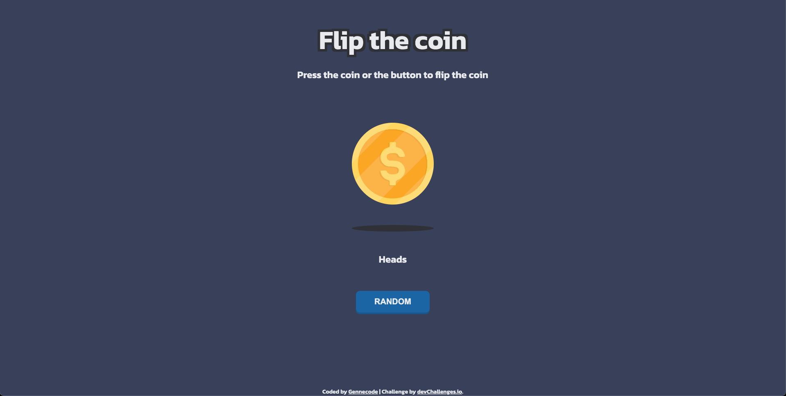

<h1 align="center">Flip the coin challenge | devChallenges</h1>

   Solution for a challenge <a href="https://devchallenges.io/challenge/flip-the-coin" target="_blank">Flip The Coin</a> from <a href="http://devchallenges.io" target="_blank">devChallenges.io</a>.

  <h3>
    <a href="https://tjaulin.github.io/flip-the-coin-challenge/">
      Demo
    </a>
     | 
    <a href="https://github.com/tjaulin/flip-the-coin-challenge">
      Solution
    </a>
     | 
    <a href="https://devchallenges.io/challenge/flip-the-coin">
      Challenge
    </a>
  </h3>

<!-- TABLE OF CONTENTS -->

## Table of Contents

- [Overview](#overview)
- [Built with](#built-with)
- [Features](#features)
- [Contact](#contact)
- [Acknowledgements](#acknowledgements)
- [Author](#author)

<!-- OVERVIEW -->

## Overview

## Built with

- Semantic HTML5 markup
- CSS custom properties
- Flexbox
- Javascript
- My Brain

## Features

This application/site was created as a submission to a [DevChallenges](https://devchallenges.io/challenges-dashboard) challenge.

## Author

- Website [My Project](https://mes-projets.vercel.app)
- GitHub [@tjaulin](https://github.com/tjaulin)
